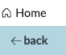

# Lab 5: Deploy & Review the AI System Record and Finalize All Pre-Deployment Activities

**To progress into the Deploy state**, all compliance-related activities must be completed, with any residual issues resolved and all required controls and monitoring activities in place for ongoing oversight. At this stage, the AI system must demonstrate compliance with global regulations and frameworks, such as the EU AI Act and the NIST AI Risk Management Framework. It must also operate ethically and responsibly in alignment with the organization's AI policies.

**Scenario**

During the Build and Test stage of the AI system lifecycle, Alene Rabeck, the AI Steward, is responsible for conducting a final review of all completed activities. After confirming that all requirements have been met, she will determine whether the AI system is ready to advance to the Deploy state.

Duration: 5 minutes

### Section 1: Deploy – Completion of activities

**Scenario**

At this stage, Alene is responsible for confirming that the Cloud Dimensions SkyTrack AI system is ready to transition to the Deploy state. For the purposes of the lab, we will impersonate Alene to perform the final validation and complete the transition.

1.  Click the **profile picture** (top right) and select **Impersonate another user**. 

    .png>)
2.  Within the popup window search for “**Alene Rebeck**” and click **Impersonate user** button. 

    <figure><figcaption></figcaption></figure>

    Note: Alene’s homepage is the **AI Control Tower** workspac&#x65;**.** 
3.  In the _Overview_ tab on the homepage, click the **number** shown under '**Build and test**' to view all AI systems currently in that state. 

    .png>)
4.  Select **Cloud Dimensions SkyTrack 1.0** from the list of AI systems. 

    <figure><figcaption></figcaption></figure>

    Note: Upon opening the Cloud Dimesions SkyTrack 1.0 record, you will see tasks assigned to Mary Cruse related to collecting information on the deployment regions of the AI system and for performing the control attestations.
5.  For the purposes of our lab, we are going to mark the 2 outstanding tasks as complete. To do so, select the following **2 open or in progress tasks** then click on the **Mark as complete** button. 

    <figure><figcaption></figcaption></figure>

    Note: Upon marking the tasks as complete, and pre-deployment assessment tasks are made available showing a task to review issues and policy exceptions and another tasks pertaining to the conformity assessment. Also, in production implementations, the _Mark as complete_ button may be disabled until all tasks are in a _Complete_ state.

    1. **Review issues and policy exceptions** - If any issues remain open, the AI system will remain in this state until they are resolved, or a valid policy exception is in place at the time of review.
    2. **Conformity assessment** – This mandatory pre-deployment step serves as an attestation that all applicable laws, regulations, and organizational policies have been satisfied. The AI Control Tower Conformity Assessment provides a standard example; however, customers can configure their own conformity assessments to be executed at this stage.
6.  For the purposes of our lab, we will mark the 2 open tasks as complete in order to move to the **Deploy** state. To do so, select the following **2 open tasks** then click on the **Mark as complete** button. 

    <figure><figcaption></figcaption></figure>

    Note: Upon marking the pre-deployment tasks as complete, the AI Asset lifecycle has now moved into the **Deploy** state. **Mary Cruse** is notified of the progression and is ready to proceed with deploying the SkyTrack AI system.
7.  To finalize the deployment of our AI System, we will mark the Deploy Asset task as complete. Select the **checkbox** next to the task and click the on **Mark as complete** button. 

    <figure><figcaption></figcaption></figure>

    Note: You may need to select the **refresh** button on the list view to see that task.

_**Congrats, you’ve Deployed the Cloud Dimensions SkyTrack AI System!**_

### Section 2: Monitor & Review of Deployed AI System (Optional)

**Scenario**

Once an AI system is deployed, the **AI Control Tower** has several metrics which provide active oversight in critical areas of any AI system and its components. **For the purposes of the lab, we will review our newly deployed AI System record which has been worked through the entire system review lifecycle.**

You should be logged in as Alene, our AI Steward.  Click on the **Home** page located on the top left-hand side of your screen.

<figure><figcaption></figcaption></figure>

Click the **back** button if you are not on the _Overview_ tab.

<figure><figcaption></figcaption></figure>

In the **All AI Systems** section, which provides a breakdown of systems by lifecycle state, click into the **Deploy** widget (The browser may need to be refreshed to see the updated number).

.png>)

Notice how the resulting list is a direct reflection of the systems we saw in the AI Risk and Compliance workspace. Similar to the last section of the lab, click into the **Cloud Dimensions SkyTrack 1.0** record. 

<figure><figcaption></figcaption></figure>

In the **AI Asset Lifecycle** visual on the left-hand side, select each state and click into the section in the middle pane to expand all the associated activities for the stage (You will likely see the section on the middle-right pane is collapsed). Recall the various activities we went through during the AI asset lifecycle.  Notice the assessments completed during the Assess stage, and the various tasks assigned during the Build and Test stage.

<figure><figcaption></figcaption></figure>

<figure><figcaption></figcaption></figure>

Click into the **Related assets** tab in the top menu to review the AI related assets to this system.  You will see one _AI model_ and two _Evaluation datasets_. If this was an agentic AI solution, other agents or skills or tools can be tied and tracked with this AI system.  When agents are discovered from outside of ServiceNow, any models, prompts, datasets and inputs/outputs used with that agent will be discovered and brought into AI Control Tower.

<figure><figcaption></figcaption></figure>

<figure><figcaption></figcaption></figure>

Click into the **Risk and Compliance** tab in the top menu to explore the various risks, controls, attestations, etc. documented on this system. Notice that this is a simplified view compared to the one we saw in the AI Risk and Compliance workspace. Click through the lists to see the collected controls, risks, assessments, and risk assessment scores.

<figure><figcaption></figcaption></figure>

Navigate back to the homepage of the workspace to revisit the dashboard view and explore all available metrics providing insightful information.

_**Congratulations, you have completed the AI Control Tower Lab!**_

<figure><figcaption></figcaption></figure>
